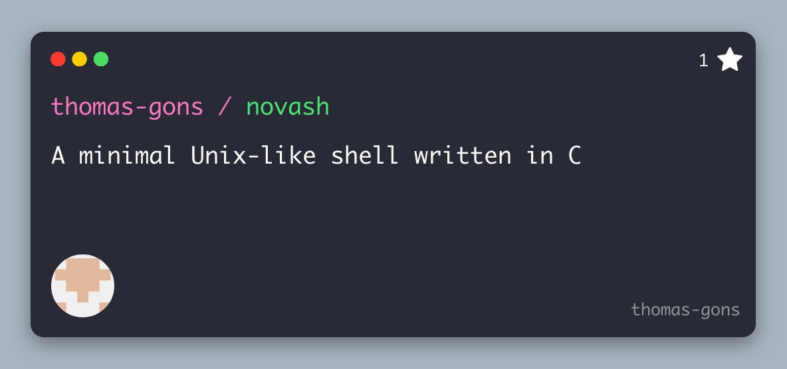

# Novash


A lightweight shell inspired by the [Build your own Shell](https://app.codecrafters.io/courses/shell/overview) roadmap from CodeCrafters.
The goal is to implement, from scratch the essential components of a modern UNIX shell including parsing, executing, background jobs and user interaction.

---

## Features

### Parsing

- [x] Tokenization (handles quotes and metacharacters)
- [x] Abstract Syntax Tree (AST) construction following a Bash-like grammar:
  ```bash
  cmd arg1 -arg2 --arg3  # command and arguments
  cmd arg1 < input.txt >> foo.txt 2> /dev/null  # redirections
  cmd1 | cmd2 | cmd3     # pipelines
  cmd1 && cmd2 || cmd3   # conditional execution
  cmd1 &; cmd2; cmd3     # sequential execution background tasks
  ```
- [x] Redirection parsing with file descriptor support (`0`, `1`, `2`)
- [x] Background task detection (`&`)
- [x] Raw command string preservation for display

### Execution Engine

- [x] Process management with fork/exec model
- [x] Process group management for job control
- [x] Synchronization using pipes for race-free process group setup
- [x] Signal masking during critical sections
- [x] Pipeline execution with proper pipe setup
- [x] Conditional execution (`&&` returns on failure, `||` returns on success)
- [x] Sequential execution with `;` separator
- [x] Background task execution (`&`)
- [x] I/O redirections:
  - Input redirection (`<`)
  - Output redirection (`>`)
  - Append redirection (`>>`)
  - File descriptor redirection (e.g., `2>`)

### Builtin Commands

- [x] **`cd`** - Change directory (supports `~` for home)
- [x] **`echo`** - Print arguments to stdout
- [x] **`pwd`** - Print current working directory
- [x] **`exit`** - Exit the shell (with running job warning)
- [x] **`type`** - Display command type (builtin or external with path)
- [x] **`history`** - Display command history
- [x] **`jobs`** - List background jobs with status
- [x] **`fg`** - Bring background job to foreground
- [x] **`bg`** - Resume stopped job in background

### Job Control

- [x] Job data structures with process pipeline support
- [x] Job states: `RUNNING`, `DONE`, `STOPPED`, `KILLED`
- [x] Process states: `RUNNING`, `DONE`, `STOPPED`, `KILLED`
- [x] Job list management (add, remove, find by PGID)
- [x] Process tracking within jobs
- [x] Background job completion notification
- [x] Job listing (`jobs` command)
- [x] Job status display with command line
- [x] Foreground/background job control (`fg`, `bg` commands)

### Signal Handling

- [x] **SIGINT** - Graceful handling of Ctrl+C
  - Cleans up readline interface
  - Redisplays prompt without terminating shell
- [x] **SIGCHLD** - Asynchronous child process reaping
  - Non-blocking waitpid with `WNOHANG`
  - Handles exited, killed, stopped, and continued processes
  - Updates job and process states
  - Notifies completion of background jobs
- [x] **SIGTTOU/SIGTTIN** - Ignored for background job control
- [x] Event-driven signal processing via readline hooks

### Terminal Control

- [x] Shell process group management
- [x] Terminal ownership with `tcsetpgrp`
- [x] Terminal mode preservation and restoration
- [x] Foreground process group control
- [x] TTY detection with fallback for non-interactive mode

### History Management

- [x] Persistent command history across sessions
- [x] Circular buffer implementation (configurable size: 1000 entries)
- [x] Stored in `.nsh_history` file
- [x] Automatic loading at shell startup
- [x] Immediate save after each command
- [x] History trimming to enforce size limits
- [x] Integration with GNU Readline history
- [x] Timestamp tracking for commands

### Shell State

- [x] Global singleton state management
- [x] Environment variable hashmap (`HOME`, `PATH`, `SHELL`, `HISTFILE`)
- [x] Current working directory tracking
- [x] Last exit status tracking
- [x] Last foreground command tracking
- [x] Job list with running job counter
- [x] Terminal modes and process group ID

### Command Line Interface

- [x] GNU Readline integration for line editing
- [x] Command history navigation (up/down arrows)
- [x] Line editing capabilities (emacs/vi modes)
- [x] Customizable prompt (`$ `)
- [x] EOF (Ctrl+D) handling with running job warning
- [x] Interrupt handling (Ctrl+C) without shell exit
- [ ] History expansion (`!cmd`)

### Command Line

- [X] Line editing (GNU Readline or linenoise)
- [X] Auto-completion (only the one provided by readline for the moment) 

--- 

## Build and Run

### Clone the repository
```sh
git clone https://github.com/thomas-gons/Novash.git
cd Novash
```

### Make the utility script executable and run it
```sh
# Make the utility script executable and run it
chmod u+x run.sh
./run.sh
```
Optional flags:
  -d, --debug       Build in Debug mode
  -b, --build-only  Only build, do not run shell or tests
  -t, --test        Build and run tests
  -c, --clean       Remove the build directories and exit
  -h, --help        Display this help message


### Or build manually with CMake
```sh
mkdir build
cd build
```
#### 1. Configuration release or debug build
```sh
# Release build
cmake .. -DCMAKE_BUILD_TYPE=Release

# Debug build with sanitizers
cmake .. -DCMAKE_BUILD_TYPE=Debug -DENABLE_SANITIZERS=ON

```
#### 2. Build the project
```sh
cmake --build . -j$(nproc) --target nsh
```

#### 3. Run the shell
```sh
# Run the shell
./build/<debug|release>/nsh
```

## Testing

Unit tests are implemented using the [Criterion framework](https://github.com/Snaipe/Criterion).

To run the tests, you can either use the `-t` or `--test` flag of the utility script.

### Manual build and run
You can also build and run the tests manually by configuring the project with the `-DENABLE_TESTS=ON` CMake option and building the test executable:

```sh
cmake --build . -j$(nproc) --target tests_novash
```
Then run the tests_novash executable located in ``./build/<debug|release>``.

**Note** : Criterion cannot be installed via CMake ``FetchContent`` and must be installed manually on your system.
Refer to the [official setup instructions](https://criterion.readthedocs.io/en/master/setup.html)

### Contributing
Contributions are welcome! Feel free to open issues or submit pull requests on GitHub.

### License
This project is licensed under the GNU General Public License v3 or later. See the [LICENSE](LICENSE) file for details.
